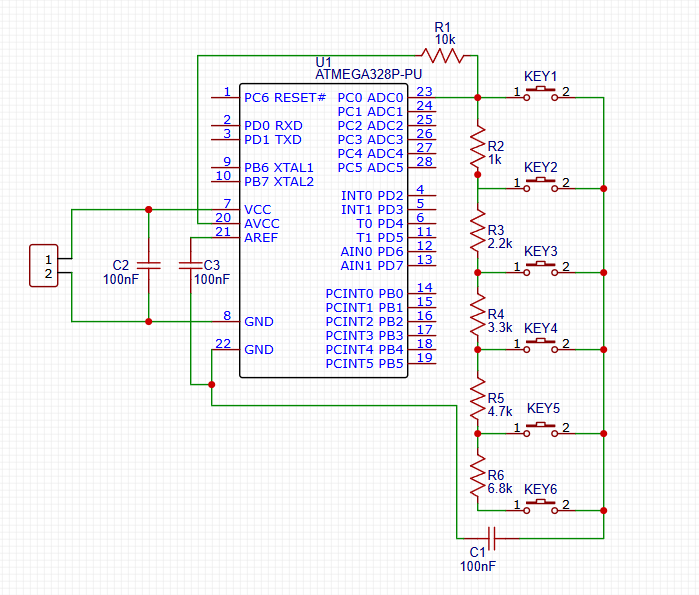
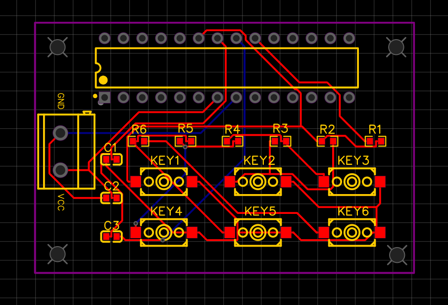
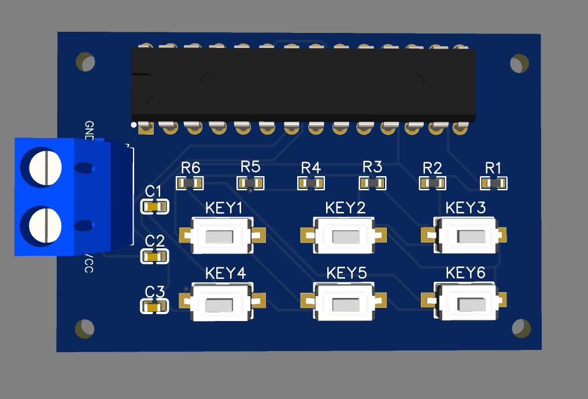

# ADC Multiple Switch using Single Analog Pin

## Overview
This project demonstrates how multiple push buttons can be read using a single ADC pin of a microcontroller using a resistor ladder network.

## Objective
To optimize GPIO usage in microcontrollers by reducing multiple digital inputs into a single analog input.

## Working Principle
- Each button produces a unique voltage using a resistor divider
- ADC reads different voltage levels
- Each voltage corresponds to a specific button

## Components
- ATmega328P / Arduino Uno
- Resistors (for voltage divider)
- Push buttons

## PCB Design
- Designed using EasyEDA

---

## Schematics

---

## PCB Design

---

## Final PCB

---